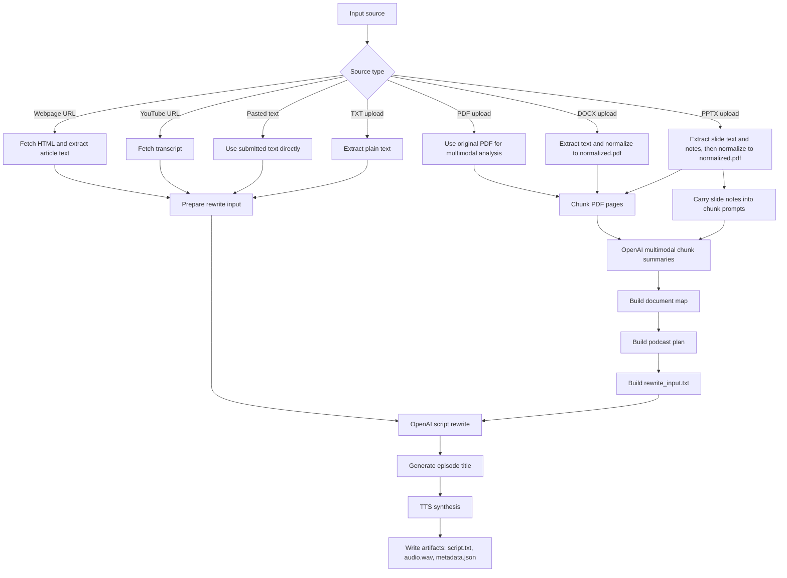

# Podcast Anything Local

Local-first backend for turning a webpage URL, YouTube URL, or uploaded
document into:

- a rewritten podcast script
- a synthesized audio file

The recommended path in this repo is:

- `OpenAI` for podcast script writing
- `Piper` for speech synthesis

Supported inputs:

- webpage URL
- YouTube URL
- pasted text
- uploaded `.txt`, `.pdf`, `.docx`, or `.pptx`

## Pipeline Overview



Uploaded `.pdf`, `.docx`, and `.pptx` documents use a shared hierarchical
multimodal pipeline with OpenAI:

- `docx` and `pptx` are normalized into `normalized.pdf`
- `pptx` slide notes are carried into the chunk-analysis prompts
- PDF chunk summaries
- a merged document map
- a podcast plan
- then the final podcast script

## What You Get

Each completed job stores its original artifacts under `data/jobs/<job_id>/`.
Typical outputs are:

- `source.txt`
- `metadata.json`
- `script.txt`
- `audio.wav`

OpenAI PDF jobs also write intermediate planning artifacts such as:

- `page_index.json`
- `chunk_001_summary.json`
- `document_map.json`
- `podcast_plan.json`
- `rewrite_input.txt`

If you use the API directly, that is the storage location you work with. If you
use the CLI, it can also download copies into a separate local folder such as
`downloads/<job_id>/`.

## Quick Start

This path is for a real end-to-end run with OpenAI for script writing and local
Piper voices for speech synthesis.

### 1. Base setup

```bash
make setup
cp .env.example .env
```

`.env.example` is already set up for the recommended stack:

- `OpenAI` for script writing
- `Piper` for TTS

Then add your OpenAI API key to `.env`:

```bash
OPENAI_API_KEY=your_key_here
```

### 2. Install Piper and download a voice

```bash
make setup-piper
make download-piper-duo-voices
make test-piper-local
make test-piper-local-duo
```

### 3. Start the API and UI

```bash
make run
```

Useful local URLs:

- UI: `http://127.0.0.1:8000/`
- API docs: `http://127.0.0.1:8000/docs`
- healthcheck: `http://127.0.0.1:8000/health`

### 4. Run a job from the UI

Open `http://127.0.0.1:8000/` and:

- choose URL, Text, or Upload
- submit a source
- watch the job status
- preview the generated script
- play or download the generated audio

The UI works against the same local API and the same job storage.

By default, the rewrite step now targets about 2-4 minutes of audio output
instead of a longer podcast episode.

If you upload a PDF while using `openai`, the job stages include `analyzing`
and `planning` before the final rewrite.

### 5. Optional: run a job from the CLI and download the outputs

```bash
make run-job ARGS="https://example.com/article --output-dir ./downloads"
```

Or submit a local file:

```bash
make run-job ARGS="--source-file ./brief.txt --output-dir ./downloads"
```

Expected result:

- the job finishes with `status: completed`
- canonical artifacts exist under `data/jobs/<job_id>/`
- the CLI downloads copies under `downloads/<job_id>/`
- the output folder includes `script.txt` and `audio.wav`

## Day-To-Day Usage

### CLI

The built-in web UI at `http://127.0.0.1:8000/` is the easiest way to use the
app interactively. The CLI is useful for quick runs and scripting.

Submit a URL, wait for completion, and download artifacts:

```bash
make run-job ARGS="https://example.com/article --output-dir ./downloads"
```

Submit a local file:

```bash
make run-job ARGS="--source-file ./brief.txt --output-dir ./downloads"
```

Direct module invocation also works:

```bash
./.venv/bin/python -m podcast_anything_local.cli \
  --source-file ./brief.txt \
  --script-mode single \
  --output-dir ./downloads
```

Useful CLI flags:

- `--script-mode single`
- `--script-mode duo`
- `--voice-id <speaker_id>`
- `--voice-id-b <speaker_id>`
- `--output-dir ./downloads`
- `--no-download`

By default, the CLI downloads copies of the completed job files into
`--output-dir/<job_id>/` such as `downloads/<job_id>/`. If you pass
`--no-download`, the job still runs, but no copies are downloaded. The original
job files remain under `data/jobs/<job_id>/`.

### API

Available endpoints:

- `GET /health`
- `POST /jobs`
- `GET /jobs`
- `GET /jobs/{job_id}`
- `GET /jobs/{job_id}/artifacts`
- `GET /jobs/{job_id}/artifacts/{artifact_name}`
- `POST /jobs/{job_id}/retry`

Create a job from a URL:

```bash
curl -X POST http://127.0.0.1:8000/jobs \
  -H "Content-Type: application/json" \
  -d '{
    "source_url": "https://example.com/article",
    "script_mode": "single"
  }'
```

Create a job from a file upload:

```bash
curl -X POST http://127.0.0.1:8000/jobs \
  -F source_file=@./brief.txt \
  -F script_mode=single
```

List a job's artifacts:

```bash
curl http://127.0.0.1:8000/jobs/<job_id>/artifacts
```

Download one artifact:

```bash
curl -L http://127.0.0.1:8000/jobs/<job_id>/artifacts/script.txt -o script.txt
```

## Configuration

The app loads `.env` automatically on startup.

The recommended configuration is:

```bash
WEB_EXTRACTOR=auto
OPENAI_BASE_URL=https://api.openai.com/v1
OPENAI_API_KEY=
OPENAI_MODEL=gpt-4o-mini

TTS_PROVIDER=piper
TTS_DEFAULT_VOICE=./data/piper_voices/en_US-ryan-high.onnx
PIPER_MODEL_PATH=./data/piper_voices/en_US-lessac-high.onnx
PIPER_CONFIG_PATH=./data/piper_voices/en_US-lessac-high.onnx.json
PIPER_MODEL_PATH_B=./data/piper_voices/en_US-ryan-high.onnx
PIPER_CONFIG_PATH_B=./data/piper_voices/en_US-ryan-high.onnx.json
PIPER_SPEAKER_ID=
PIPER_SPEAKER_ID_B=
```

In this recommended setup, single-host podcasts default to `ryan-high`. For
duo mode, `HOST_A` uses `lessac-high` and `HOST_B` uses `ryan-high`.

For long PDFs where layout, figures, and page visuals matter, a stronger OpenAI
model such as `gpt-4.1` is usually a better choice than `gpt-4o-mini`.

Most important settings:

- `WEB_EXTRACTOR`
- `TTS_PROVIDER`
- `OPENAI_API_KEY`
- `OPENAI_MODEL`
- `PIPER_MODEL_PATH`
- `PIPER_CONFIG_PATH`
- `DATA_DIR`

If you want hosted TTS instead of local Piper:

- set `TTS_PROVIDER=elevenlabs` and fill in `ELEVENLABS_API_KEY`

OpenAI is the only built-in podcast script writer in this repo. The rewrite
provider boundary is still isolated in code so future providers such as Grok or
Claude can be added later without reworking the rest of the pipeline.

## Notes

- `WEB_EXTRACTOR=auto` tries `trafilatura` first and falls back to `bs4`
- `WEB_EXTRACTOR=trafilatura` forces article extraction through `trafilatura`
- `WEB_EXTRACTOR=bs4` forces the simpler BeautifulSoup paragraph extractor
- uploaded `.pdf`, `.docx`, and `.pptx` files use the hierarchical multimodal
  OpenAI path
- `docx` and `pptx` are normalized into `normalized.pdf` before page-chunk
  analysis
- `pptx` slide notes are saved as `slide_notes.json` and included in the
  chunk-analysis prompts
- PDFs without extractable embedded text can still work through the multimodal
  OpenAI path
- rewritten scripts are targeted to about 2-4 minutes of spoken audio and are
  capped to an approximate spoken-word budget before TTS
- `make test-piper-local` writes a sample WAV through the project provider
- `make test-piper-local-duo` writes a two-host WAV using `PIPER_MODEL_PATH` for
  `HOST_A` and `PIPER_MODEL_PATH_B` for `HOST_B`
- for file uploads, send `multipart/form-data`
- for URL submissions, use JSON or form data, but provide exactly one of
  `source_url`, `source_text`, or `source_file`

## Development

Run the test suite:

```bash
make test
```

## CI

This repo includes two GitHub Actions workflows:

- `CI`
  Runs on every pull request and on pushes to `main`. It installs the project,
  compiles `src/`, `tests/`, and `scripts/`, and runs the full pytest suite on
  Python `3.11` and `3.13`.
- `Integration Hosted`
  Runs on `workflow_dispatch` and nightly. It runs a real OpenAI rewrite smoke
  test and a real Piper smoke test. To enable the OpenAI job, add the
  `OPENAI_API_KEY` GitHub Actions secret to the repository.

If you want to mirror the required CI locally, run:

```bash
make test-ci
```

Verified locally:

- `make test`
- `make test-piper-local`
- `make test-openai-live MODEL=gpt-4o-mini`

## Troubleshooting

- If `make run` fails, make sure you ran `make setup` first.
- If `.env` changes are not reflected, restart the API process.
- If `make test-piper-local` fails, check that the Piper voice files exist under
  `data/piper_voices/`.
- If `make test-openai-live` fails, confirm `OPENAI_API_KEY` is set and the
  selected `OPENAI_MODEL` is available to your account.
