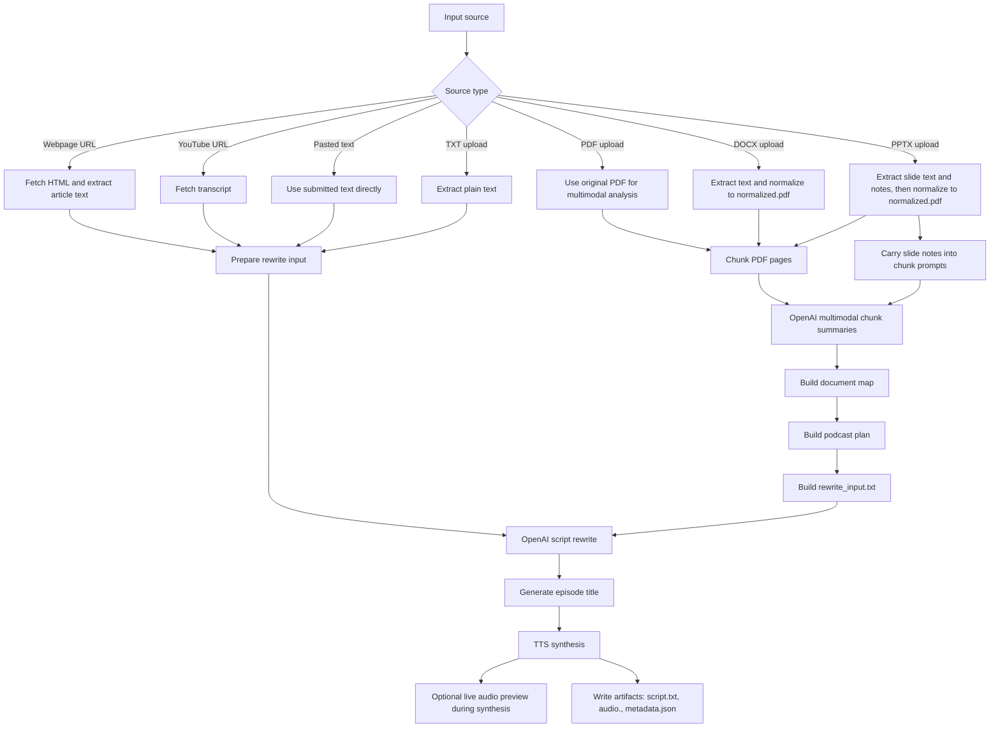

<p align="center">
  <picture>
    <source media="(prefers-color-scheme: dark)" srcset="assets/logo_dark.png" />
    <source media="(prefers-color-scheme: light)" srcset="assets/logo_light.png" />
    
  </picture>
</p>

Podcast Anything turns source material into a short podcast draft. Give it a
webpage URL, YouTube URL, pasted text, or an uploaded document, and it will
produce a rewritten script, an episode title, and synthesized audio.

The project is built for local or self-hosted use. The default stack is:

- `OpenAI` for podcast script writing
- `OpenAI` for podcast voice generation

Documents with layout or slide structure go through a multimodal planning path.
`pdf`, `docx`, and `pptx` inputs are analyzed as page-based documents before the
final script is written, and `pptx` slide notes are included in that analysis.
The built-in UI can also show the draft script before completion and preview
audio during synthesis when the selected TTS path supports it.

## Table of Contents

- [Supported Features](#supported-features)
- [Pipeline Overview](#pipeline-overview)
- [Artifacts](#artifacts)
- [Quick Start](#quick-start)
  - [1. Create the environment](#1-create-the-environment)
  - [2. Review TTS defaults](#2-review-tts-defaults)
  - [3. Start the app](#3-start-the-app)
  - [4. Submit a job](#4-submit-a-job)
- [Docker](#docker)
- [Usage](#usage)
  - [Web UI](#web-ui)
  - [CLI](#cli)
  - [API](#api)
- [Configuration](#configuration)
- [Development](#development)
- [CI](#ci)
- [Releases](#releases)
- [Troubleshooting](#troubleshooting)

## Supported Features

| Capability | Support | Notes |
| --- | --- | --- |
| Webpage URL input | Yes | Fetches HTML and extracts article text with `trafilatura` or `bs4` |
| YouTube URL input | Yes | Uses transcript-based ingestion |
| Pasted text input | Yes | Direct text-to-podcast path |
| TXT upload | Yes | Plain text ingestion |
| PDF upload | Yes | Uses the multimodal document pipeline |
| DOCX upload | Yes | Extracts text, then normalizes into `normalized.pdf` |
| PPTX upload | Yes | Extracts slide text and notes, then normalizes into `normalized.pdf` |
| Podcast modes | `single`, `duo` | Single-host or two-host script structure |
| Episode length presets | `short`, `medium`, `long` | `short`: 2-3 min, `medium`: 4-5 min, `long`: 6-10 min |
| Script writer | OpenAI | Current built-in rewrite provider |
| Voice generators | OpenAI, ElevenLabs | OpenAI is the default option; ElevenLabs is the higher-quality alternate |
| Live audio preview | Yes | ElevenLabs `single` and `duo` stream live; OpenAI `single` streams live; OpenAI `duo` plays progressive preview segments |
| Interfaces | Web UI, API, CLI | All use the same local job store |
| Output artifacts | Yes | `script.txt`, `audio.<ext>`, `metadata.json`, plus planning artifacts for document jobs |

## Pipeline Overview



## Artifacts

Each completed job stores its canonical artifacts under:

```text
data/jobs/<job_id>/
```

Typical outputs:

- `source.txt`
- `script.txt`
- `audio.wav` or `audio.mp3`
- `metadata.json`

Document jobs can also write intermediate artifacts such as:

- `normalized.pdf`
- `normalized_page_context.json`
- `slide_notes.json`
- `page_index.json`
- `chunk_001_summary.json`
- `document_map.json`
- `podcast_plan.json`
- `rewrite_input.txt`

OpenAI `duo` jobs can also write temporary preview artifacts such as
`preview_audio_001.wav` while synthesis is in progress.

If you use the CLI, it can also download copies into a separate folder such as:

```text
downloads/<job_id>/
```

## Quick Start

### 1. Create the environment

```bash
make setup
cp .env.example .env
```

Then add your OpenAI key to `.env`:

```bash
OPENAI_API_KEY=your_key_here
```

### 2. Review TTS defaults

```bash
TTS_PROVIDER=openai
OPENAI_TTS_MODEL=gpt-4o-mini-tts
OPENAI_TTS_VOICE=marin
OPENAI_TTS_VOICE_B=cedar
OPENAI_TTS_RESPONSE_FORMAT=wav
```

If you want to use ElevenLabs instead, set:

```bash
TTS_PROVIDER=elevenlabs
ELEVENLABS_API_KEY=your_key_here
ELEVENLABS_DIALOGUE_MODEL_ID=eleven_v3
ELEVENLABS_VOICE_ID=your_voice_id_here
ELEVENLABS_VOICE_ID_B=your_second_voice_id_here
```

### 3. Start the app

```bash
make run
```

Useful local URLs:

- UI: `http://127.0.0.1:8000/`
- API docs: `http://127.0.0.1:8000/docs`
- healthcheck: `http://127.0.0.1:8000/health`

### 4. Submit a job

From the UI:

- choose `URL`, `Text`, or `Upload`
- choose `Short`, `Medium`, or `Long` episode length in `Studio`
- submit a source
- monitor progress
- preview the script
- listen during synthesis when live preview is available
- play or download the final audio

From the CLI:

```bash
make run-job ARGS="https://example.com/article --output-dir ./downloads"
```

Or upload a local file:

```bash
make run-job ARGS="--source-file ./brief.txt --output-dir ./downloads"
```

Expected result:

- the job reaches `status: completed`
- canonical artifacts are written under `data/jobs/<job_id>/`
- if you used the CLI without `--no-download`, copies are written under `downloads/<job_id>/`

## Docker

You can run the app as a container instead of a local virtual environment.

Build the image locally:

```bash
make docker-build
```

Run it with your `.env` file and a mounted data directory:

```bash
make docker-run
```

This maps:

- `http://127.0.0.1:8000/` to the container
- `./data` on your machine to `/app/data` in the container

If you prefer plain Docker commands:

```bash
docker build -t podcast-anything-local:dev .
docker run --rm -p 8000:8000 --env-file .env -v "$(pwd)/data:/app/data" podcast-anything-local:dev
```

## Usage

### Web UI

The built-in UI at `http://127.0.0.1:8000/` is the easiest way to run and
inspect jobs locally.

### CLI

Direct module usage also works:

```bash
./.venv/bin/python -m podcast_anything_local.cli \
  --source-file ./brief.txt \
  --script-mode single \
  --podcast-length medium \
  --output-dir ./downloads
```

Useful CLI flags:

- `--script-mode single`
- `--script-mode duo`
- `--podcast-length short|medium|long`
- `--voice-id <speaker_id>`
- `--voice-id-b <speaker_id>`
- `--output-dir ./downloads`
- `--no-download`

By default, the CLI downloads copies of completed job files into
`--output-dir/<job_id>/`. If you pass `--no-download`, the job still runs, but
the canonical artifacts remain only under `data/jobs/<job_id>/`.

### API

Available endpoints:

- `GET /health`
- `POST /jobs`
- `GET /jobs`
- `GET /jobs/{job_id}`
- `GET /jobs/{job_id}/artifacts`
- `GET /jobs/{job_id}/artifacts/{artifact_name}`
- `GET /jobs/{job_id}/audio-stream`
- `POST /jobs/{job_id}/retry`

Create a job from a URL:

```bash
curl -X POST http://127.0.0.1:8000/jobs \
  -H "Content-Type: application/json" \
  -d '{
    "source_url": "https://example.com/article",
    "script_mode": "single",
    "podcast_length": "medium"
  }'
```

Create a job from a file upload:

```bash
curl -X POST http://127.0.0.1:8000/jobs \
  -F source_file=@./brief.txt \
  -F script_mode=single \
  -F podcast_length=medium
```

List a job's artifacts:

```bash
curl http://127.0.0.1:8000/jobs/<job_id>/artifacts
```

Download one artifact:

```bash
curl -L http://127.0.0.1:8000/jobs/<job_id>/artifacts/script.txt -o script.txt
```

## Configuration

The app loads `.env` automatically on startup.

Recommended configuration:

```bash
WEB_EXTRACTOR=auto
OPENAI_BASE_URL=https://api.openai.com/v1
OPENAI_API_KEY=
OPENAI_MODEL=gpt-4o-mini
PODCAST_LENGTH_DEFAULT=medium

TTS_PROVIDER=openai
OPENAI_TTS_MODEL=gpt-4o-mini-tts
OPENAI_TTS_VOICE=marin
OPENAI_TTS_VOICE_B=cedar
OPENAI_TTS_RESPONSE_FORMAT=wav
ELEVENLABS_VOICE_ID=
ELEVENLABS_VOICE_ID_B=
```

In this setup:

- single-host podcasts default to OpenAI voice `marin`
- duo mode uses OpenAI voices `marin` for `HOST_A` and `cedar` for `HOST_B`

Important settings:

- `WEB_EXTRACTOR`
- `OPENAI_API_KEY`
- `OPENAI_MODEL`
- `PODCAST_LENGTH_DEFAULT`
- `TTS_PROVIDER`
- `OPENAI_TTS_MODEL`
- `OPENAI_TTS_VOICE`
- `DATA_DIR`

Notes:

- `WEB_EXTRACTOR=auto` tries `trafilatura` first and falls back to `bs4`
- `WEB_EXTRACTOR=trafilatura` forces `trafilatura`
- `WEB_EXTRACTOR=bs4` forces the simpler BeautifulSoup extractor
- `PODCAST_LENGTH_DEFAULT` sets the default UI/API length preset for new jobs
- for long PDFs with figures, layout, and page visuals, `gpt-4.1` is usually a
  stronger choice than `gpt-4o-mini`
- if you want hosted TTS with the same vendor as script writing, set
  `TTS_PROVIDER=openai`; `OPENAI_TTS_RESPONSE_FORMAT=wav` is recommended and is
  required for reliable duo turn joining
- if you want ElevenLabs instead of OpenAI TTS, set `TTS_PROVIDER=elevenlabs`
  and fill in `ELEVENLABS_API_KEY` plus `ELEVENLABS_VOICE_ID`
- the built-in UI can preview audio during synthesis:
  ElevenLabs `single` and `duo` stream live, OpenAI `single` streams live, and
  OpenAI `duo` plays progressive preview segments while the final file is
  assembled
- ElevenLabs `single` uses the standard text-to-speech endpoint
- ElevenLabs `duo` uses the dedicated text-to-dialogue endpoint with
  `ELEVENLABS_DIALOGUE_MODEL_ID`, which works better on plans like `Creator`

OpenAI is the only built-in podcast script writer in this repo. The rewrite
provider boundary is still isolated in code so future providers such as Grok or
Claude can be added later without redesigning the rest of the pipeline.

## Development

Run the test suite:

```bash
make test
```

Run lint and formatting checks:

```bash
make lint
```

Apply Ruff fixes and formatting:

```bash
make format
```

## CI

This repo includes two GitHub Actions workflows:

- `CI`
  Runs on every pull request and on pushes to `main`. It runs `ruff check .`,
  `ruff format --check .`, compiles `src/`, `tests/`, and `scripts/`, then
  runs the full pytest suite on Python `3.11` and `3.13`.
- `Integration Hosted`
  Runs on `workflow_dispatch` and nightly. It runs a real OpenAI rewrite smoke
  test. To enable it, add the `OPENAI_API_KEY` GitHub Actions secret to the
  repository.

If you want to mirror the required CI locally:

```bash
make test-ci
```

Verified locally:

- `make test`
- `make test-openai-live MODEL=gpt-4o-mini`
- `./.venv/bin/python -m pytest tests/test_tts_elevenlabs.py`
- `make test-elevenlabs-live`
- `make test-elevenlabs-live DUO=1`

## Releases

This repo now includes a tag-driven release workflow in
[`release.yml`](.github/workflows/release.yml).

Recommended release flow:

1. Update [CHANGELOG.md](CHANGELOG.md) and move any user-facing items out of
   `Unreleased`.
2. Bump the version in [pyproject.toml](pyproject.toml).
3. Run the local release gate:
   `make test-ci`
4. Make sure the hosted smoke workflow is green if the release changes OpenAI
   behavior.
5. Commit the release prep on `main`.
6. Create and push a tag such as `v0.2.0`:

```bash
git tag v0.2.0
git push origin main --follow-tags
```

What happens next:

- GitHub Actions builds the Python wheel
- the workflow creates a GitHub Release for the tag
- built artifacts from `dist/` are attached to that release
- the workflow also builds and pushes a GHCR image:
  `ghcr.io/<owner>/podcast-anything-local:<tag>`

You can also trigger the release workflow manually for an existing tag from the
Actions tab.

## Troubleshooting

- If `make run` fails, make sure you ran `make setup` first.
- If `.env` changes are not reflected, restart the API process.
- If `make test-openai-live` fails, confirm `OPENAI_API_KEY` is set and the
  selected `OPENAI_MODEL` is available to your account.
- If live audio preview does not appear in the UI, confirm the selected TTS
  path supports it for that mode: ElevenLabs `single`/`duo`, OpenAI `single`,
  or OpenAI `duo`.
- If ElevenLabs duo synthesis fails, confirm `ELEVENLABS_VOICE_ID_B` is set and
  that your account can access the `ELEVENLABS_DIALOGUE_MODEL_ID` you selected.
