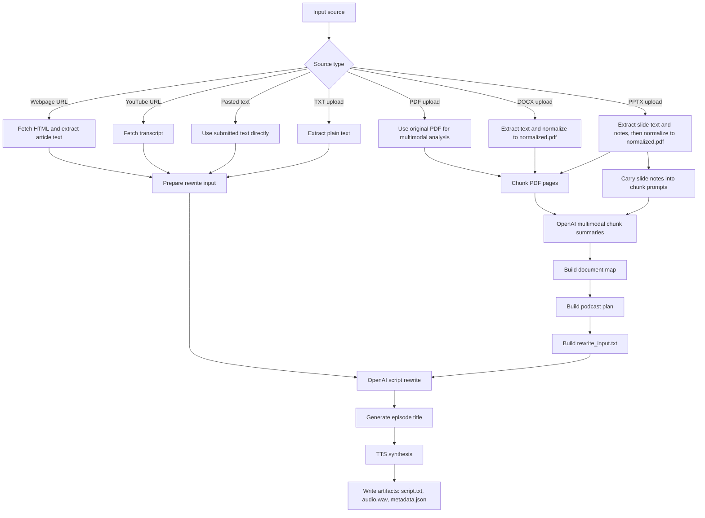

# Podcast Anything

Podcast Anything turns source material into a short podcast draft. Give it a
webpage URL, YouTube URL, pasted text, or an uploaded document, and it will
produce a rewritten script, an episode title, and synthesized audio.

The project is built for local or self-hosted use. The default stack is:

- `OpenAI` for podcast script writing
- `Piper` for local voice generation

Documents with layout or slide structure go through a multimodal planning path.
`pdf`, `docx`, and `pptx` inputs are analyzed as page-based documents before the
final script is written, and `pptx` slide notes are included in that analysis.

## Supported Features

| Capability | Support | Notes |
| --- | --- | --- |
| Webpage URL input | Yes | Fetches HTML and extracts article text with `trafilatura` or `bs4` |
| YouTube URL input | Yes | Uses transcript-based ingestion |
| Pasted text input | Yes | Direct text-to-podcast path |
| TXT upload | Yes | Plain text ingestion |
| PDF upload | Yes | Uses the multimodal document pipeline |
| DOCX upload | Yes | Extracts text, then normalizes into `normalized.pdf` |
| PPTX upload | Yes | Extracts slide text and notes, then normalizes into `normalized.pdf` |
| Podcast modes | `single`, `duo` | Targets about 2-4 minutes of audio |
| Script writer | OpenAI | Current built-in rewrite provider |
| Voice generators | Piper, ElevenLabs | Piper is the default local option |
| Interfaces | Web UI, API, CLI | All use the same local job store |
| Output artifacts | Yes | `script.txt`, `audio.wav`, `metadata.json`, plus planning artifacts for document jobs |

## Pipeline Overview



## Artifacts

Each completed job stores its canonical artifacts under:

```text
data/jobs/<job_id>/
```

Typical outputs:

- `source.txt`
- `script.txt`
- `audio.wav`
- `metadata.json`

Document jobs can also write intermediate artifacts such as:

- `normalized.pdf`
- `normalized_page_context.json`
- `slide_notes.json`
- `page_index.json`
- `chunk_001_summary.json`
- `document_map.json`
- `podcast_plan.json`
- `rewrite_input.txt`

If you use the CLI, it can also download copies into a separate folder such as:

```text
downloads/<job_id>/
```

## Quick Start

### 1. Create the environment

```bash
make setup
cp .env.example .env
```

Then add your OpenAI key to `.env`:

```bash
OPENAI_API_KEY=your_key_here
```

### 2. Install Piper and download voices

```bash
make setup-piper
make download-piper-duo-voices
make test-piper-local
make test-piper-local-duo
```

### 3. Start the app

```bash
make run
```

Useful local URLs:

- UI: `http://127.0.0.1:8000/`
- API docs: `http://127.0.0.1:8000/docs`
- healthcheck: `http://127.0.0.1:8000/health`

### 4. Submit a job

From the UI:

- choose `URL`, `Text`, or `Upload`
- submit a source
- monitor progress
- preview the script
- play or download the audio

From the CLI:

```bash
make run-job ARGS="https://example.com/article --output-dir ./downloads"
```

Or upload a local file:

```bash
make run-job ARGS="--source-file ./brief.txt --output-dir ./downloads"
```

Expected result:

- the job reaches `status: completed`
- canonical artifacts are written under `data/jobs/<job_id>/`
- if you used the CLI without `--no-download`, copies are written under `downloads/<job_id>/`

## Usage

### Web UI

The built-in UI at `http://127.0.0.1:8000/` is the easiest way to run and
inspect jobs locally.

### CLI

Direct module usage also works:

```bash
./.venv/bin/python -m podcast_anything_local.cli \
  --source-file ./brief.txt \
  --script-mode single \
  --output-dir ./downloads
```

Useful CLI flags:

- `--script-mode single`
- `--script-mode duo`
- `--voice-id <speaker_id>`
- `--voice-id-b <speaker_id>`
- `--output-dir ./downloads`
- `--no-download`

By default, the CLI downloads copies of completed job files into
`--output-dir/<job_id>/`. If you pass `--no-download`, the job still runs, but
the canonical artifacts remain only under `data/jobs/<job_id>/`.

### API

Available endpoints:

- `GET /health`
- `POST /jobs`
- `GET /jobs`
- `GET /jobs/{job_id}`
- `GET /jobs/{job_id}/artifacts`
- `GET /jobs/{job_id}/artifacts/{artifact_name}`
- `POST /jobs/{job_id}/retry`

Create a job from a URL:

```bash
curl -X POST http://127.0.0.1:8000/jobs \
  -H "Content-Type: application/json" \
  -d '{
    "source_url": "https://example.com/article",
    "script_mode": "single"
  }'
```

Create a job from a file upload:

```bash
curl -X POST http://127.0.0.1:8000/jobs \
  -F source_file=@./brief.txt \
  -F script_mode=single
```

List a job's artifacts:

```bash
curl http://127.0.0.1:8000/jobs/<job_id>/artifacts
```

Download one artifact:

```bash
curl -L http://127.0.0.1:8000/jobs/<job_id>/artifacts/script.txt -o script.txt
```

## Configuration

The app loads `.env` automatically on startup.

Recommended configuration:

```bash
WEB_EXTRACTOR=auto
OPENAI_BASE_URL=https://api.openai.com/v1
OPENAI_API_KEY=
OPENAI_MODEL=gpt-4o-mini

TTS_PROVIDER=piper
TTS_DEFAULT_VOICE=./data/piper_voices/en_US-ryan-high.onnx
PIPER_MODEL_PATH=./data/piper_voices/en_US-lessac-high.onnx
PIPER_CONFIG_PATH=./data/piper_voices/en_US-lessac-high.onnx.json
PIPER_MODEL_PATH_B=./data/piper_voices/en_US-ryan-high.onnx
PIPER_CONFIG_PATH_B=./data/piper_voices/en_US-ryan-high.onnx.json
PIPER_SPEAKER_ID=
PIPER_SPEAKER_ID_B=
```

In this setup:

- single-host podcasts default to `ryan-high`
- duo mode uses `lessac-high` for `HOST_A` and `ryan-high` for `HOST_B`

Important settings:

- `WEB_EXTRACTOR`
- `OPENAI_API_KEY`
- `OPENAI_MODEL`
- `TTS_PROVIDER`
- `PIPER_MODEL_PATH`
- `PIPER_CONFIG_PATH`
- `DATA_DIR`

Notes:

- `WEB_EXTRACTOR=auto` tries `trafilatura` first and falls back to `bs4`
- `WEB_EXTRACTOR=trafilatura` forces `trafilatura`
- `WEB_EXTRACTOR=bs4` forces the simpler BeautifulSoup extractor
- for long PDFs with figures, layout, and page visuals, `gpt-4.1` is usually a
  stronger choice than `gpt-4o-mini`
- if you want hosted TTS instead of local Piper, set `TTS_PROVIDER=elevenlabs`
  and fill in `ELEVENLABS_API_KEY`

OpenAI is the only built-in podcast script writer in this repo. The rewrite
provider boundary is still isolated in code so future providers such as Grok or
Claude can be added later without redesigning the rest of the pipeline.

## Development

Run the test suite:

```bash
make test
```

## CI

This repo includes two GitHub Actions workflows:

- `CI`
  Runs on every pull request and on pushes to `main`. It compiles `src/`,
  `tests/`, and `scripts/`, then runs the full pytest suite on Python `3.11`
  and `3.13`.
- `Integration Hosted`
  Runs on `workflow_dispatch` and nightly. It runs a real OpenAI rewrite smoke
  test and a real Piper smoke test. To enable the OpenAI job, add the
  `OPENAI_API_KEY` GitHub Actions secret to the repository.

If you want to mirror the required CI locally:

```bash
make test-ci
```

Verified locally:

- `make test`
- `make test-piper-local`
- `make test-openai-live MODEL=gpt-4o-mini`

## Troubleshooting

- If `make run` fails, make sure you ran `make setup` first.
- If `.env` changes are not reflected, restart the API process.
- If `make test-piper-local` fails, check that the Piper voice files exist under
  `data/piper_voices/`.
- If `make test-openai-live` fails, confirm `OPENAI_API_KEY` is set and the
  selected `OPENAI_MODEL` is available to your account.
